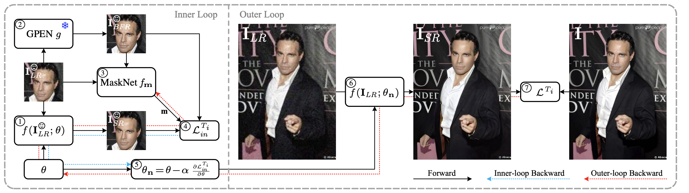

# MetaF2N: Blind Image Super-Resolution by Learning Efficient Model Adaptation from Faces

<a href="https://arxiv.org/pdf/2309.08113.pdf"></a>

>**Abstract**: <br>
> Due to their highly structured characteristics, faces are easier to recover than natural scenes for blind image super-resolution. Therefore, we can extract the degradation representation of an image from the low-quality and recovered face pairs. Using the degradation representation, realistic low-quality images can then be synthesized to fine-tune the super-resolution model for the real-world low-quality image. However, such a procedure is time-consuming and laborious, and the gaps between recovered faces and the ground-truths further increase the optimization uncertainty. To facilitate efficient model adaptation towards image-specific degradations, we propose a method dubbed MetaF2N, which leverages the contained Faces to fine-tune model parameters for adapting to the whole Natural image in a Meta-learning framework. The degradation extraction and low-quality image synthesis steps are thus circumvented in our MetaF2N, and it requires only one fine-tuning step to get decent performance. Considering the gaps between the recovered faces and ground-truths, we further deploy a MaskNet for adaptively predicting loss weights at different positions to reduce the impact of low-confidence areas. To evaluate our proposed MetaF2N, we have collected a real-world low-quality dataset with one or multiple faces in each image, and our MetaF2N achieves superior performance on both synthetic and real-world datasets.



## Getting Started

### Environment Setup

```shell
git clone https://github.com/yinzhicun/MetaF2N.git
cd MetaF2N
conda create -n metaf2n python=3.9
conda activate metaf2n
pip install -r requirements.txt
```

### Pretrained Models

We provide the pretrained checkpoints in [BaiduDisk](https://pan.baidu.com/s/1Up3W9OKVNgdZT1mwQHZeoQ?pwd=7fm2) and [Google Drive](https://drive.google.com/drive/folders/1R0ekBOXWufM5vu0PZNYeCpAPS2R1w3gf?usp=drive_link). One can download them and save to the directory `./pretrained_models`.

Moreover, the other models (pretrained GPEN, Real-ESRGAN and RetinaFace) we need for training and testing are also provided in [BaiduDisk](https://pan.baidu.com/s/13GEXwwA2250V18_oyWuSnA?pwd=8es6) and [Google Drive](https://drive.google.com/drive/folders/1UyduarmLBkZ38NCRQSiuJSjrtPqWQXiX?usp=drive_link). One can download them and save to the directory `./weights`.

### Preparing Dataset

- Since we use tensoflow as our framework, we prepare our training data in the format of .tfrecord as [BaiduDisk](https://pan.baidu.com/s/1jNOJEbFr1KdFT08Gfmanqw?pwd=9qgp) and Google Drive(will be prepared soon). One can download them and save to the directory `./datasets`.

- If you want to prepare the training data yourself, you can use the generate_tfrecord.py and change the parameters.
    ```shell
    python scripts/generate_tfrecord.py
    ```

- All the test data are provided as [BaiduDisk](https://pan.baidu.com/s/1PXQSzpyqzsLg6MR9_IYn0Q?pwd=ydps) and [Google Drive](https://drive.google.com/drive/folders/13aGnJXZiEKSRanu7bu6pJGutvMvKFeuV?usp=drive_link). Each synthsized dataset has two subfolders (GT, LQ), while the RealFaces200 dataset only has a RF200.txt to show the source or the link of every image. Noted that two subfolders Face_HQ and Face_LQ are also needed during test, you can generate them youself with generate_test_faces.py.
    ```shell
    python generate_test_faces.py --input_dir input_dir --output_dir output_dir
    ```

- The final test data structure is like this:
    ```shell
    ├── datasets
    │   ├── CelebA_iid
    │   │   ├── Face_HQ
    │   │   ├── Face_LQ
    │   │   ├── GT
    │   │   └── LQ
    │   ├── CelebA_ood
    │   │   ├── Face_HQ
    │   │   ├── Face_LQ
    │   │   ├── GT
    │   │   └── LQ
    │   ├── FFHQ_iid
    │   │   ├── Face_HQ
    │   │   ├── Face_LQ
    │   │   ├── GT
    │   │   └── LQ
    │   ├── FFHQ_Multi_iid
    │   │   ├── Face_HQ
    │   │   ├── Face_LQ
    │   │   ├── GT
    │   │   └── LQ
    │   ├── FFHQ_Multi_ood
    │   │   ├── Face_HQ
    │   │   ├── Face_LQ
    │   │   ├── GT
    │   │   └── LQ
    │   ├── FFHQ_ood
    │   │   ├── Face_HQ
    │   │   ├── Face_LQ
    │   │   ├── GT
    │   │   └── LQ
    │   └── RealFaces200
    │       ├── Face_HQ
    │       ├── Face_LQ
    │       └── LQ
    ```
    
### Testing

To test the method, you can run,

```Shell
CUDA_VISIBLE_DEVICES=0 test.py --input_dir input_dir --output_dir output_dir --face_dir face_dir --patch_size patch_size --patch_num_per_img patch_num_per_img --fine_tune_num fine_tune_num
```

#### __Four parameters can be changed for flexible usage:__
```
--input_dir # test LQ image path
--output_dir # save the results path
--face_dir # the path that contains Face_LQ (Cropped LQ Face Area) and Face_HQ (Retored HQ Face Area)
--patch_size # the patch size for the cropping of HQ face area
--patch_num_per_img # the number of patches for the cropping of HQ face area
--fine_tune_num # the steps of the inner loop fine-tuning

```

### Training

To train MetaF2N, you can adjust the parameters in config.py and run,

```Shell
python main.py --trial trial --step step --gpu gpu_id
```

### Calculate Metrics

To calculate metrics of the results, you can run,

```Shell
python calculate_metrics.py --result_dir result_dir --gt_dir gt_dir --fid_ref_dir fid_ref_dir
```

## Citation

```
@article{yin2023metaf2n,
  title={MetaF2N: Blind Image Super-Resolution by Learning Efficient Model Adaptation from Faces},
  author={Yin, Zhicun and Liu, Ming and Li, Xiaoming and Yang, Hui and Xiao, Longan and Zuo, Wangmeng},
  journal={arXiv preprint arXiv:2309.08113},
  year={2023}
}
```

## Acknowledgements

This code is built on [MZSR](https://github.com/JWSoh/MZSR), [GPEN](https://github.com/yangxy/GPEN) and [LPIPS-Tensorflow](https://github.com/alexlee-gk/lpips-tensorflow). We thank the authors for sharing the codes.

## Statement for RF200 Dataset

The images of RF200 dataset are collected from the Internet and existed datasets. However, the individual images were published online by their respective authors. We do not have the authorization of these images and some of them require giving appropriate credit to the original author, as well as indicating any changes that were made to the images. Moreover, the authorizations of these images can also change in the future. Therefore, we only provide a txt file RF200.txt to show the source and the link of every image.
